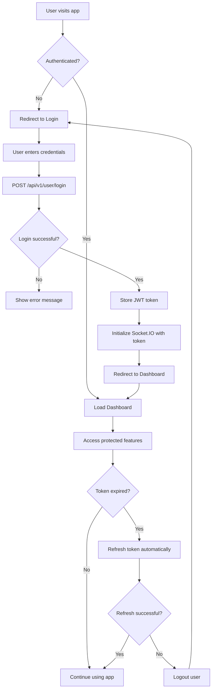

# Complete TalentBridge API Integration Guide 💬🔐

## Overview
This comprehensive guide covers the complete TalentBridge platform integration including authentication, chat system, and all API endpoints. The platform supports real-time messaging, user management, job posting, course management, and role-based access control.

## 🏗️ Complete Architecture Overview

```
Frontend Client ↔ Authentication ↔ Socket.IO ↔ Express Server ↔ MongoDB
                        ↕               ↕
                   JWT Tokens    Chat Controllers & Services
                        ↕               ↕
                   User Sessions    Redis Cache (Optional)
```

## 📋 Prerequisites

1. **Node.js**: Version 16+ installed
2. **Socket.IO**: Client-side Socket.IO library
3. **Axios**: For HTTP requests
4. **API Base URL**: `http://localhost:4000` (development)
5. **Environment**: Modern browser with WebSocket support

## 🔐 Authentication System

### Authentication API Endpoints

#### 1. User Registration
```http
POST /api/v1/user/register
Content-Type: application/json

{
  "name": "John Doe",
  "email": "john@example.com", 
  "password": "securePassword123",
  "role": "student",
  "phone": "+1234567890"
}
```

**Response:**
```json
{
  "success": true,
  "message": "User registered successfully",
  "data": {
    "user": {
      "_id": "60f7b1b9b9f1c72a8c8b4567",
      "name": "John Doe",
      "email": "john@example.com",
      "role": "student",
      "isEmailVerified": false,
      "createdAt": "2024-08-19T10:30:00.000Z"
    },
    "token": "eyJhbGciOiJIUzI1NiIsInR5cCI6IkpXVCJ9..."
  }
}
```

#### 2. User Login
```http
POST /api/v1/user/login
Content-Type: application/json

{
  "email": "john@example.com",
  "password": "securePassword123"
}
```

**Response:**
```json
{
  "success": true,
  "message": "Login successful",
  "data": {
    "user": {
      "_id": "60f7b1b9b9f1c72a8c8b4567",
      "name": "John Doe", 
      "email": "john@example.com",
      "role": "student",
      "isEmailVerified": true,
      "lastLogin": "2024-08-19T10:35:00.000Z"
    },
    "token": "eyJhbGciOiJIUzI1NiIsInR5cCI6IkpXVCJ9...",
    "expiresIn": "7d"
  }
}
```

#### 3. User Logout
```http
POST /api/v1/user/logout
Authorization: Bearer <JWT_TOKEN>
```

**Response:**
```json
{
  "success": true,
  "message": "Logout successful"
}
```

#### 4. Refresh Token
```http
POST /api/v1/user/refresh-token
Authorization: Bearer <JWT_TOKEN>
```

**Response:**
```json
{
  "success": true,
  "message": "Token refreshed successfully",
  "data": {
    "token": "eyJhbGciOiJIUzI1NiIsInR5cCI6IkpXVCJ9...",
    "expiresIn": "7d"
  }
}
```

#### 5. Get Current User Profile
```http
GET /api/v1/user/profile
Authorization: Bearer <JWT_TOKEN>
```

**Response:**
```json
{
  "success": true,
  "message": "Profile retrieved successfully",
  "data": {
    "user": {
      "_id": "60f7b1b9b9f1c72a8c8b4567",
      "name": "John Doe",
      "email": "john@example.com",
      "role": "student",
      "phone": "+1234567890",
      "profilePicture": "https://example.com/profile.jpg",
      "isEmailVerified": true,
      "preferences": {
        "notifications": true,
        "marketing": false
      },
      "createdAt": "2024-08-19T10:30:00.000Z",
      "updatedAt": "2024-08-19T10:35:00.000Z"
    }
  }
}
```

#### 6. Password Reset Request
```http
POST /api/v1/user/forgot-password
Content-Type: application/json

{
  "email": "john@example.com"
}
```

#### 7. Password Reset Confirmation
```http
POST /api/v1/user/reset-password
Content-Type: application/json

{
  "token": "resetTokenFromEmail",
  "newPassword": "newSecurePassword123"
}
```

### Authentication Implementation

#### Frontend Authentication Service
```javascript
// auth.js - Complete Authentication Service
import axios from 'axios';

const API_BASE = 'http://localhost:4000/api/v1';

class AuthService {
  constructor() {
    this.token = localStorage.getItem('authToken');
    this.user = JSON.parse(localStorage.getItem('user') || 'null');
    this.setupAxiosInterceptors();
  }

  // Setup axios interceptors for automatic token handling
  setupAxiosInterceptors() {
    // Request interceptor
    axios.interceptors.request.use(
      (config) => {
        const token = localStorage.getItem('authToken');
        if (token) {
          config.headers.Authorization = `Bearer ${token}`;
        }
        return config;
      },
      (error) => Promise.reject(error)
    );

    // Response interceptor
    axios.interceptors.response.use(
      (response) => response,
      async (error) => {
        const originalRequest = error.config;
        
        if (error.response?.status === 401 && !originalRequest._retry) {
          originalRequest._retry = true;
          
          try {
            await this.refreshToken();
            return axios(originalRequest);
          } catch (refreshError) {
            this.logout();
            window.location.href = '/login';
            return Promise.reject(refreshError);
          }
        }
        
        return Promise.reject(error);
      }
    );
  }

  // Register new user
  async register(userData) {
    try {
      const response = await axios.post(`${API_BASE}/user/register`, userData);
      const { user, token } = response.data.data;
      
      this.setAuthData(user, token);
      return response.data;
    } catch (error) {
      throw this.handleAuthError(error);
    }
  }

  // Login user
  async login(email, password) {
    try {
      const response = await axios.post(`${API_BASE}/user/login`, {
        email,
        password
      });
      
      const { user, token } = response.data.data;
      this.setAuthData(user, token);
      
      return response.data;
    } catch (error) {
      throw this.handleAuthError(error);
    }
  }

  // Logout user
  async logout() {
    try {
      if (this.token) {
        await axios.post(`${API_BASE}/user/logout`);
      }
    } catch (error) {
      console.error('Logout error:', error);
    } finally {
      this.clearAuthData();
    }
  }

  // Refresh token
  async refreshToken() {
    try {
      const response = await axios.post(`${API_BASE}/user/refresh-token`);
      const { token } = response.data.data;
      
      localStorage.setItem('authToken', token);
      this.token = token;
      
      return token;
    } catch (error) {
      this.clearAuthData();
      throw error;
    }
  }

  // Get current user profile
  async getProfile() {
    try {
      const response = await axios.get(`${API_BASE}/user/profile`);
      const { user } = response.data.data;
      
      localStorage.setItem('user', JSON.stringify(user));
      this.user = user;
      
      return user;
    } catch (error) {
      throw this.handleAuthError(error);
    }
  }

  // Update user profile
  async updateProfile(userData) {
    try {
      const response = await axios.put(`${API_BASE}/user/profile`, userData);
      const { user } = response.data.data;
      
      localStorage.setItem('user', JSON.stringify(user));
      this.user = user;
      
      return user;
    } catch (error) {
      throw this.handleAuthError(error);
    }
  }

  // Forgot password
  async forgotPassword(email) {
    try {
      const response = await axios.post(`${API_BASE}/user/forgot-password`, {
        email
      });
      return response.data;
    } catch (error) {
      throw this.handleAuthError(error);
    }
  }

  // Reset password
  async resetPassword(token, newPassword) {
    try {
      const response = await axios.post(`${API_BASE}/user/reset-password`, {
        token,
        newPassword
      });
      return response.data;
    } catch (error) {
      throw this.handleAuthError(error);
    }
  }

  // Helper methods
  setAuthData(user, token) {
    localStorage.setItem('authToken', token);
    localStorage.setItem('user', JSON.stringify(user));
    this.token = token;
    this.user = user;
  }

  clearAuthData() {
    localStorage.removeItem('authToken');
    localStorage.removeItem('user');
    this.token = null;
    this.user = null;
  }

  isAuthenticated() {
    return !!this.token && !!this.user;
  }

  getCurrentUser() {
    return this.user;
  }

  getToken() {
    return this.token;
  }

  hasRole(role) {
    return this.user?.role === role;
  }

  hasAnyRole(roles) {
    return roles.includes(this.user?.role);
  }

  handleAuthError(error) {
    const message = error.response?.data?.message || error.message || 'Authentication failed';
    return new Error(message);
  }
}

// Create singleton instance
const authService = new AuthService();
export default authService;
```

#### React Authentication Hook
```javascript
// useAuth.js - React Hook for Authentication
import { useState, useEffect, useContext, createContext } from 'react';
import authService from './authService';

const AuthContext = createContext();

export const AuthProvider = ({ children }) => {
  const [user, setUser] = useState(authService.getCurrentUser());
  const [loading, setLoading] = useState(true);
  const [isAuthenticated, setIsAuthenticated] = useState(authService.isAuthenticated());

  useEffect(() => {
    const initAuth = async () => {
      try {
        if (authService.isAuthenticated()) {
          const userProfile = await authService.getProfile();
          setUser(userProfile);
          setIsAuthenticated(true);
        }
      } catch (error) {
        console.error('Auth initialization failed:', error);
        authService.logout();
        setIsAuthenticated(false);
        setUser(null);
      } finally {
        setLoading(false);
      }
    };

    initAuth();
  }, []);

  const login = async (email, password) => {
    try {
      setLoading(true);
      const response = await authService.login(email, password);
      setUser(response.data.user);
      setIsAuthenticated(true);
      return response;
    } catch (error) {
      setIsAuthenticated(false);
      setUser(null);
      throw error;
    } finally {
      setLoading(false);
    }
  };

  const register = async (userData) => {
    try {
      setLoading(true);
      const response = await authService.register(userData);
      setUser(response.data.user);
      setIsAuthenticated(true);
      return response;
    } catch (error) {
      setIsAuthenticated(false);
      setUser(null);
      throw error;
    } finally {
      setLoading(false);
    }
  };

  const logout = async () => {
    try {
      setLoading(true);
      await authService.logout();
    } finally {
      setUser(null);
      setIsAuthenticated(false);
      setLoading(false);
    }
  };

  const updateProfile = async (userData) => {
    try {
      const updatedUser = await authService.updateProfile(userData);
      setUser(updatedUser);
      return updatedUser;
    } catch (error) {
      throw error;
    }
  };

  const value = {
    user,
    isAuthenticated,
    loading,
    login,
    register,
    logout,
    updateProfile,
    hasRole: (role) => authService.hasRole(role),
    hasAnyRole: (roles) => authService.hasAnyRole(roles)
  };

  return (
    <AuthContext.Provider value={value}>
      {children}
    </AuthContext.Provider>
  );
};

export const useAuth = () => {
  const context = useContext(AuthContext);
  if (!context) {
    throw new Error('useAuth must be used within an AuthProvider');
  }
  return context;
};
```

#### Protected Route Component
```javascript
// ProtectedRoute.jsx - Route Protection
import React from 'react';
import { Navigate, useLocation } from 'react-router-dom';
import { useAuth } from './useAuth';

const ProtectedRoute = ({ children, requiredRole, requiredRoles }) => {
  const { isAuthenticated, user, loading, hasRole, hasAnyRole } = useAuth();
  const location = useLocation();

  if (loading) {
    return (
      <div className="loading-container">
        <div className="spinner">Loading...</div>
      </div>
    );
  }

  if (!isAuthenticated) {
    return <Navigate to="/login" state={{ from: location }} replace />;
  }

  if (requiredRole && !hasRole(requiredRole)) {
    return <Navigate to="/unauthorized" replace />;
  }

  if (requiredRoles && !hasAnyRole(requiredRoles)) {
    return <Navigate to="/unauthorized" replace />;
  }

  return children;
};

export default ProtectedRoute;
```

### Role-Based Access Control

#### User Roles and Permissions
```javascript
// roles.js - Role definitions and permissions
export const USER_ROLES = {
  ADMIN: 'admin',
  STUDENT: 'student', 
  EMPLOYER: 'employer',
  SCHOOL: 'school'
};

export const PERMISSIONS = {
  // Chat permissions
  CHAT_PRIVATE: ['student', 'employer', 'school', 'admin'],
  CHAT_GROUP: ['employer', 'school', 'admin'],
  CHAT_BROADCAST: ['school', 'admin'],
  
  // Job permissions
  JOB_CREATE: ['employer', 'admin'],
  JOB_VIEW: ['student', 'employer', 'school', 'admin'],
  JOB_APPLY: ['student'],
  
  // Course permissions
  COURSE_CREATE: ['school', 'admin'],
  COURSE_VIEW: ['student', 'employer', 'school', 'admin'],
  COURSE_ENROLL: ['student'],
  
  // Admin permissions
  USER_MANAGE: ['admin'],
  SYSTEM_CONFIG: ['admin']
};

export const checkPermission = (userRole, permission) => {
  return PERMISSIONS[permission]?.includes(userRole) || false;
};
```

## 🚀 Quick Start Implementation

### 1. Authentication Setup First

Before implementing chat, you need to set up authentication:

```javascript
// app.js - Main Application Setup
import React from 'react';
import { BrowserRouter as Router, Routes, Route } from 'react-router-dom';
import { AuthProvider } from './services/useAuth';
import Login from './components/Login';
import Register from './components/Register';
import Dashboard from './components/Dashboard';
import Chat from './components/Chat';
import ProtectedRoute from './components/ProtectedRoute';

function App() {
  return (
    <AuthProvider>
      <Router>
        <Routes>
          <Route path="/login" element={<Login />} />
          <Route path="/register" element={<Register />} />
          <Route 
            path="/dashboard" 
            element={
              <ProtectedRoute>
                <Dashboard />
              </ProtectedRoute>
            } 
          />
          <Route 
            path="/chat" 
            element={
              <ProtectedRoute requiredRoles={['student', 'employer', 'school', 'admin']}>
                <Chat />
              </ProtectedRoute>
            } 
          />
        </Routes>
      </Router>
    </AuthProvider>
  );
}

export default App;
```

### 2. Login Component

```jsx
// Login.jsx - User Authentication
import React, { useState } from 'react';
import { useAuth } from '../services/useAuth';
import { useNavigate, useLocation } from 'react-router-dom';

const Login = () => {
  const [formData, setFormData] = useState({
    email: '',
    password: ''
  });
  const [loading, setLoading] = useState(false);
  const [error, setError] = useState('');
  
  const { login } = useAuth();
  const navigate = useNavigate();
  const location = useLocation();
  
  const from = location.state?.from?.pathname || '/dashboard';

  const handleSubmit = async (e) => {
    e.preventDefault();
    setLoading(true);
    setError('');

    try {
      await login(formData.email, formData.password);
      navigate(from, { replace: true });
    } catch (error) {
      setError(error.message);
    } finally {
      setLoading(false);
    }
  };

  const handleChange = (e) => {
    setFormData({
      ...formData,
      [e.target.name]: e.target.value
    });
  };

  return (
    <div className="login-container">
      <form onSubmit={handleSubmit} className="login-form">
        <h2>Login to TalentBridge</h2>
        
        {error && <div className="error-message">{error}</div>}
        
        <div className="form-group">
          <label htmlFor="email">Email:</label>
          <input
            type="email"
            id="email"
            name="email"
            value={formData.email}
            onChange={handleChange}
            required
            placeholder="Enter your email"
          />
        </div>

        <div className="form-group">
          <label htmlFor="password">Password:</label>
          <input
            type="password"
            id="password"
            name="password"
            value={formData.password}
            onChange={handleChange}
            required
            placeholder="Enter your password"
          />
        </div>

        <button 
          type="submit" 
          disabled={loading}
          className="login-button"
        >
          {loading ? 'Logging in...' : 'Login'}
        </button>
        
        <div className="auth-links">
          <a href="/register">Don't have an account? Register</a>
          <a href="/forgot-password">Forgot Password?</a>
        </div>
      </form>
    </div>
  );
};

export default Login;
```

### 3. Chat Service Setup (After Authentication)

```javascript
// chatService.js - Chat API and Socket Service
import io from 'socket.io-client';
import axios from 'axios';
import authService from './authService';

const API_BASE = 'http://localhost:4000/api/v1';

class ChatService {
  constructor() {
    this.socket = null;
    this.isConnected = false;
  }

  // Initialize socket connection (call after login)
  initializeSocket() {
    const token = authService.getToken();
    if (!token) {
      throw new Error('Authentication required for chat');
    }

    this.socket = io('http://localhost:4000', {
      auth: {
        token: token
      },
      transports: ['websocket', 'polling']
    });

    this.setupSocketEvents();
    return this.socket;
  }

  setupSocketEvents() {
    this.socket.on('connect', () => {
      console.log('✅ Connected to chat server');
      this.isConnected = true;
    });

    this.socket.on('disconnect', (reason) => {
      console.log('❌ Disconnected from chat server:', reason);
      this.isConnected = false;
    });

    this.socket.on('connect_error', (error) => {
      console.error('❌ Socket connection error:', error);
      // Handle authentication errors
      if (error.message.includes('Authentication')) {
        authService.logout();
        window.location.href = '/login';
      }
    });
  }

  // Disconnect socket (call on logout)
  disconnect() {
    if (this.socket) {
      this.socket.disconnect();
      this.socket = null;
      this.isConnected = false;
    }
  }

  // Chat API methods
  async createConversation(participantId, type = 'private') {
    const response = await axios.post(`${API_BASE}/chat/conversations`, {
      participants: [participantId],
      type
    });
    return response.data;
  }

  async getConversations() {
    const response = await axios.get(`${API_BASE}/chat/conversations`);
    return response.data;
  }

  async getMessages(conversationId, page = 1, limit = 50) {
    const response = await axios.get(
      `${API_BASE}/chat/conversations/${conversationId}/messages?page=${page}&limit=${limit}`
    );
    return response.data;
  }

  async sendMessage(conversationId, content, type = 'text') {
    const response = await axios.post(`${API_BASE}/chat/messages`, {
      conversationId,
      content,
      type
    });
    return response.data;
  }

  // Socket methods
  joinConversation(conversationId) {
    if (this.isConnected) {
      this.socket.emit('join_conversation', { conversationId });
    }
  }

  leaveConversation(conversationId) {
    if (this.isConnected) {
      this.socket.emit('leave_conversation', { conversationId });
    }
  }

  sendMessageSocket(conversationId, content, type = 'text') {
    if (this.isConnected) {
      const messageData = {
        conversationId,
        content,
        type,
        timestamp: new Date().toISOString()
      };
      this.socket.emit('send_message', messageData);
      return messageData;
    }
    throw new Error('Socket not connected');
  }

  markAsRead(conversationId, messageId) {
    if (this.isConnected) {
      this.socket.emit('mark_read', { conversationId, messageId });
    }
  }

  startTyping(conversationId) {
    if (this.isConnected) {
      this.socket.emit('typing_start', { conversationId });
    }
  }

  stopTyping(conversationId) {
    if (this.isConnected) {
      this.socket.emit('typing_stop', { conversationId });
    }
  }
}

// Create singleton instance
const chatService = new ChatService();
export default chatService;
```

### 4. Complete API Endpoints Reference

#### Authentication Endpoints
```javascript
const AUTH_ENDPOINTS = {
  register: 'POST /api/v1/user/register',
  login: 'POST /api/v1/user/login',
  logout: 'POST /api/v1/user/logout',
  refreshToken: 'POST /api/v1/user/refresh-token',
  profile: 'GET /api/v1/user/profile',
  updateProfile: 'PUT /api/v1/user/profile',
  forgotPassword: 'POST /api/v1/user/forgot-password',
  resetPassword: 'POST /api/v1/user/reset-password'
};
```

### 2. Socket.IO Real-time Implementation

```javascript
// socketChat.js - Real-time Chat Handler
class ChatSocketManager {
  constructor() {
    this.socket = socket;
    this.setupEventHandlers();
  }

  setupEventHandlers() {
    // Connection events
    this.socket.on('connect', () => {
      console.log('✅ Connected to chat server');
    });

    this.socket.on('disconnect', () => {
      console.log('❌ Disconnected from chat server');
    });

    // Chat events
    this.socket.on('new_message', (message) => {
      console.log('📩 New message received:', message);
      this.handleNewMessage(message);
    });

    this.socket.on('message_delivered', (data) => {
      console.log('✅ Message delivered:', data);
      this.updateMessageStatus(data.messageId, 'delivered');
    });

    this.socket.on('message_read', (data) => {
      console.log('👁️ Message read:', data);
      this.updateMessageStatus(data.messageId, 'read');
    });

    this.socket.on('user_typing', (data) => {
      console.log('⌨️ User typing:', data);
      this.showTypingIndicator(data.userId, data.conversationId);
    });

    this.socket.on('user_stopped_typing', (data) => {
      console.log('⏹️ User stopped typing:', data);
      this.hideTypingIndicator(data.userId, data.conversationId);
    });

    this.socket.on('conversation_updated', (conversation) => {
      console.log('🔄 Conversation updated:', conversation);
      this.updateConversation(conversation);
    });

    // Error handling
    this.socket.on('error', (error) => {
      console.error('❌ Socket error:', error);
    });
  }

  // Join a conversation room
  joinConversation(conversationId) {
    this.socket.emit('join_conversation', { conversationId });
  }

  // Leave a conversation room
  leaveConversation(conversationId) {
    this.socket.emit('leave_conversation', { conversationId });
  }

  // Send a message via socket (real-time)
  sendMessage(conversationId, content, type = 'text') {
    const messageData = {
      conversationId,
      content,
      type,
      timestamp: new Date().toISOString()
    };
    this.socket.emit('send_message', messageData);
    return messageData;
  }

  // Mark message as read
  markAsRead(conversationId, messageId) {
    this.socket.emit('mark_read', { conversationId, messageId });
  }

  // Send typing indicator
  startTyping(conversationId) {
    this.socket.emit('typing_start', { conversationId });
  }

  // Stop typing indicator
  stopTyping(conversationId) {
    this.socket.emit('typing_stop', { conversationId });
  }

  // Event handler methods (implement based on your UI framework)
  handleNewMessage(message) {
    // Add message to your chat UI
    // Update conversation list
    // Show notification if needed
  }

  updateMessageStatus(messageId, status) {
    // Update message status in your UI (delivered/read)
  }

  showTypingIndicator(userId, conversationId) {
    // Show typing indicator in conversation
  }

  hideTypingIndicator(userId, conversationId) {
    // Hide typing indicator
  }

  updateConversation(conversation) {
    // Update conversation in your UI
  }
}

// Initialize chat manager
const chatManager = new ChatSocketManager();
export default chatManager;
```

### 3. React Chat Component Example

```jsx
// ChatComponent.jsx
import React, { useState, useEffect, useRef } from 'react';
import { chatAPI } from './services/chatAPI';
import chatManager from './services/socketChat';

const ChatComponent = ({ conversationId }) => {
  const [messages, setMessages] = useState([]);
  const [newMessage, setNewMessage] = useState('');
  const [isTyping, setIsTyping] = useState(false);
  const [conversations, setConversations] = useState([]);
  const messagesEndRef = useRef(null);

  useEffect(() => {
    loadConversations();
    loadMessages();
    
    // Join conversation room
    if (conversationId) {
      chatManager.joinConversation(conversationId);
    }

    // Setup real-time event handlers
    chatManager.handleNewMessage = (message) => {
      if (message.conversationId === conversationId) {
        setMessages(prev => [...prev, message]);
        scrollToBottom();
      }
    };

    chatManager.showTypingIndicator = (userId, convId) => {
      if (convId === conversationId) {
        setIsTyping(true);
      }
    };

    chatManager.hideTypingIndicator = (userId, convId) => {
      if (convId === conversationId) {
        setIsTyping(false);
      }
    };

    return () => {
      if (conversationId) {
        chatManager.leaveConversation(conversationId);
      }
    };
  }, [conversationId]);

  const loadConversations = async () => {
    try {
      const response = await chatAPI.getConversations();
      setConversations(response.data);
    } catch (error) {
      console.error('Failed to load conversations:', error);
    }
  };

  const loadMessages = async () => {
    if (!conversationId) return;
    
    try {
      const response = await chatAPI.getMessages(conversationId);
      setMessages(response.data);
      scrollToBottom();
    } catch (error) {
      console.error('Failed to load messages:', error);
    }
  };

  const sendMessage = async () => {
    if (!newMessage.trim() || !conversationId) return;

    try {
      // Send via socket for real-time delivery
      chatManager.sendMessage(conversationId, newMessage);
      
      // Optimistically add to UI
      const tempMessage = {
        _id: Date.now(),
        content: newMessage,
        sender: { _id: 'current-user' }, // Replace with actual user ID
        createdAt: new Date(),
        status: 'sending'
      };
      setMessages(prev => [...prev, tempMessage]);
      setNewMessage('');
      scrollToBottom();
    } catch (error) {
      console.error('Failed to send message:', error);
    }
  };

  const scrollToBottom = () => {
    messagesEndRef.current?.scrollIntoView({ behavior: 'smooth' });
  };

  const handleTyping = () => {
    chatManager.startTyping(conversationId);
    // Stop typing after 3 seconds of inactivity
    setTimeout(() => {
      chatManager.stopTyping(conversationId);
    }, 3000);
  };

  return (
    <div className="chat-container">
      {/* Conversation List */}
      <div className="conversations-sidebar">
        <h3>Conversations</h3>
        {conversations.map(conv => (
          <div key={conv._id} className="conversation-item">
            <h4>{conv.title || 'Private Chat'}</h4>
            <p>{conv.lastMessage?.content}</p>
          </div>
        ))}
      </div>

      {/* Messages Area */}
      <div className="messages-container">
        <div className="messages-list">
          {messages.map(message => (
            <div key={message._id} className={`message ${message.sender._id === 'current-user' ? 'sent' : 'received'}`}>
              <div className="message-content">{message.content}</div>
              <div className="message-time">{new Date(message.createdAt).toLocaleTimeString()}</div>
              {message.status && <div className="message-status">{message.status}</div>}
            </div>
          ))}
          {isTyping && <div className="typing-indicator">Someone is typing...</div>}
          <div ref={messagesEndRef} />
        </div>

        {/* Message Input */}
        <div className="message-input-container">
          <input
            type="text"
            value={newMessage}
            onChange={(e) => setNewMessage(e.target.value)}
            onKeyDown={(e) => {
              if (e.key === 'Enter') sendMessage();
              else handleTyping();
            }}
            placeholder="Type a message..."
            className="message-input"
          />
          <button onClick={sendMessage} className="send-button">
            Send
          </button>
        </div>
      </div>
    </div>
  );
};

export default ChatComponent;
```

## 🔐 Authentication & Authorization

### JWT Token Setup
```javascript
// auth.js - Authentication helper
export const setupAuthHeaders = (token) => {
  // For API calls
  axios.defaults.headers.common['Authorization'] = `Bearer ${token}`;
  
  // For Socket.IO
  if (socket.connected) {
    socket.disconnect();
  }
  socket.auth = { token };
  socket.connect();
};

// Role-based access control
export const checkChatAccess = (userRole, conversationType) => {
  const rolePermissions = {
    student: ['private'],
    employer: ['private', 'group'],
    school: ['private', 'group', 'broadcast'],
    admin: ['private', 'group', 'broadcast']
  };
  
  return rolePermissions[userRole]?.includes(conversationType) || false;
};
```

## 📊 API Endpoints Reference

#### Chat Endpoints
```javascript
const CHAT_ENDPOINTS = {
  // Conversations
  createConversation: 'POST /api/v1/chat/conversations',
  getConversations: 'GET /api/v1/chat/conversations',
  getConversation: 'GET /api/v1/chat/conversations/:id',
  updateConversation: 'PUT /api/v1/chat/conversations/:id',
  deleteConversation: 'DELETE /api/v1/chat/conversations/:id',
  
  // Messages
  sendMessage: 'POST /api/v1/chat/messages',
  getMessages: 'GET /api/v1/chat/conversations/:id/messages',
  updateMessage: 'PUT /api/v1/chat/messages/:id',
  deleteMessage: 'DELETE /api/v1/chat/messages/:id',
  markAsRead: 'PUT /api/v1/chat/messages/:id/read'
};
```

#### Job Management Endpoints
```javascript
const JOB_ENDPOINTS = {
  createJob: 'POST /api/v1/jobs',
  searchJobs: 'GET /api/v1/jobs/search',
  getJob: 'GET /api/v1/jobs/:id',
  updateJob: 'PUT /api/v1/jobs/:id',
  deleteJob: 'DELETE /api/v1/jobs/:id',
  applyToJob: 'POST /api/v1/jobs/:id/apply',
  getMyJobs: 'GET /api/v1/jobs/my-jobs', // For employers
  getApplications: 'GET /api/v1/jobs/:id/applications'
};
```

#### Course Management Endpoints
```javascript
const COURSE_ENDPOINTS = {
  createCourse: 'POST /api/v1/courses',
  getCourses: 'GET /api/v1/courses',
  getCourse: 'GET /api/v1/courses/:id',
  updateCourse: 'PUT /api/v1/courses/:id',
  deleteCourse: 'DELETE /api/v1/courses/:id',
  enrollCourse: 'POST /api/v1/courses/:id/enroll',
  getMyCourses: 'GET /api/v1/courses/my-courses'
};
```

#### Notification Endpoints
```javascript
const NOTIFICATION_ENDPOINTS = {
  getNotifications: 'GET /api/v1/notifications',
  getNotificationCount: 'GET /api/v1/notifications/count',
  markAsRead: 'PUT /api/v1/notifications/:id/read',
  markAllAsRead: 'PUT /api/v1/notifications/mark-all-read',
  deleteNotification: 'DELETE /api/v1/notifications/:id',
  getPreferences: 'GET /api/v1/notifications/preferences',
  updatePreferences: 'PUT /api/v1/notifications/preferences'
};
```

### 5. Complete Implementation Example

#### Main Application with Authentication
```jsx
// App.jsx - Complete Application Setup
import React, { useEffect } from 'react';
import { BrowserRouter as Router, Routes, Route, Navigate } from 'react-router-dom';
import { AuthProvider, useAuth } from './services/useAuth';
import chatService from './services/chatService';

// Components
import Login from './components/Login';
import Register from './components/Register';
import Dashboard from './components/Dashboard';
import Chat from './components/Chat';
import Jobs from './components/Jobs';
import Courses from './components/Courses';
import Profile from './components/Profile';
import ProtectedRoute from './components/ProtectedRoute';
import Navigation from './components/Navigation';
import './App.css';

// Main App Component
function AppContent() {
  const { isAuthenticated, user, loading } = useAuth();

  useEffect(() => {
    // Initialize chat socket when user is authenticated
    if (isAuthenticated && user) {
      try {
        chatService.initializeSocket();
        console.log('Chat service initialized for user:', user.name);
      } catch (error) {
        console.error('Failed to initialize chat service:', error);
      }
    }

    // Cleanup socket on logout
    return () => {
      if (!isAuthenticated) {
        chatService.disconnect();
      }
    };
  }, [isAuthenticated, user]);

  if (loading) {
    return (
      <div className="loading-screen">
        <div className="spinner"></div>
        <p>Loading TalentBridge...</p>
      </div>
    );
  }

  return (
    <Router>
      <div className="app">
        {isAuthenticated && <Navigation />}
        
        <main className="main-content">
          <Routes>
            {/* Public Routes */}
            <Route 
              path="/login" 
              element={!isAuthenticated ? <Login /> : <Navigate to="/dashboard" />} 
            />
            <Route 
              path="/register" 
              element={!isAuthenticated ? <Register /> : <Navigate to="/dashboard" />} 
            />
            
            {/* Protected Routes */}
            <Route 
              path="/dashboard" 
              element={
                <ProtectedRoute>
                  <Dashboard />
                </ProtectedRoute>
              } 
            />
            
            <Route 
              path="/chat/*" 
              element={
                <ProtectedRoute requiredRoles={['student', 'employer', 'school', 'admin']}>
                  <Chat />
                </ProtectedRoute>
              } 
            />
            
            <Route 
              path="/jobs/*" 
              element={
                <ProtectedRoute>
                  <Jobs />
                </ProtectedRoute>
              } 
            />
            
            <Route 
              path="/courses/*" 
              element={
                <ProtectedRoute>
                  <Courses />
                </ProtectedRoute>
              } 
            />
            
            <Route 
              path="/profile" 
              element={
                <ProtectedRoute>
                  <Profile />
                </ProtectedRoute>
              } 
            />
            
            {/* Admin Routes */}
            <Route 
              path="/admin/*" 
              element={
                <ProtectedRoute requiredRole="admin">
                  <AdminPanel />
                </ProtectedRoute>
              } 
            />
            
            {/* Default redirect */}
            <Route 
              path="/" 
              element={
                isAuthenticated ? 
                <Navigate to="/dashboard" /> : 
                <Navigate to="/login" />
              } 
            />
            
            {/* 404 handler */}
            <Route path="*" element={<NotFound />} />
          </Routes>
        </main>
      </div>
    </Router>
  );
}

// App wrapper with AuthProvider
function App() {
  return (
    <AuthProvider>
      <AppContent />
    </AuthProvider>
  );
}

export default App;
```

#### Navigation Component
```jsx
// Navigation.jsx - App Navigation
import React from 'react';
import { Link, useLocation, useNavigate } from 'react-router-dom';
import { useAuth } from '../services/useAuth';

const Navigation = () => {
  const { user, logout, hasRole } = useAuth();
  const location = useLocation();
  const navigate = useNavigate();

  const handleLogout = async () => {
    try {
      await logout();
      navigate('/login');
    } catch (error) {
      console.error('Logout failed:', error);
    }
  };

  const isActive = (path) => location.pathname.startsWith(path);

  return (
    <nav className="main-navigation">
      <div className="nav-brand">
        <Link to="/dashboard">TalentBridge</Link>
      </div>

      <div className="nav-menu">
        <Link 
          to="/dashboard" 
          className={isActive('/dashboard') ? 'active' : ''}
        >
          Dashboard
        </Link>

        <Link 
          to="/chat" 
          className={isActive('/chat') ? 'active' : ''}
        >
          Messages
        </Link>

        <Link 
          to="/jobs" 
          className={isActive('/jobs') ? 'active' : ''}
        >
          {hasRole('employer') ? 'Manage Jobs' : 'Find Jobs'}
        </Link>

        <Link 
          to="/courses" 
          className={isActive('/courses') ? 'active' : ''}
        >
          {hasRole('school') ? 'Manage Courses' : 'Courses'}
        </Link>

        {hasRole('admin') && (
          <Link 
            to="/admin" 
            className={isActive('/admin') ? 'active' : ''}
          >
            Admin
          </Link>
        )}
      </div>

      <div className="nav-user">
        <div className="user-info">
          
          <span className="user-name">{user?.name}</span>
          <span className="user-role">{user?.role}</span>
        </div>

        <div className="user-menu">
          <Link to="/profile">Profile</Link>
          <button onClick={handleLogout} className="logout-btn">
            Logout
          </button>
        </div>
      </div>
    </nav>
  );
};

export default Navigation;
```

### Socket Events

#### Client → Server Events
- `join_conversation` - Join conversation room
- `leave_conversation` - Leave conversation room
- `send_message` - Send new message
- `mark_read` - Mark message as read
- `typing_start` - Start typing indicator
- `typing_stop` - Stop typing indicator

#### Server → Client Events
- `new_message` - New message received
- `message_delivered` - Message delivery confirmation
- `message_read` - Message read confirmation
- `user_typing` - User typing notification
- `user_stopped_typing` - User stopped typing
- `conversation_updated` - Conversation metadata updated

## 🔐 Authentication & Authorization Flow

### Complete Auth Flow Diagram


### JWT Token Management
```javascript
// tokenManager.js - Advanced token management
class TokenManager {
  constructor() {
    this.token = localStorage.getItem('authToken');
    this.refreshTimer = null;
    this.setupTokenRefresh();
  }

  setToken(token) {
    this.token = token;
    localStorage.setItem('authToken', token);
    this.setupTokenRefresh();
  }

  getToken() {
    return this.token;
  }

  clearToken() {
    this.token = null;
    localStorage.removeItem('authToken');
    if (this.refreshTimer) {
      clearTimeout(this.refreshTimer);
    }
  }

  // Decode JWT to get expiration
  decodeToken(token) {
    try {
      const base64Url = token.split('.')[1];
      const base64 = base64Url.replace(/-/g, '+').replace(/_/g, '/');
      const jsonPayload = decodeURIComponent(atob(base64).split('').map(function(c) {
        return '%' + ('00' + c.charCodeAt(0).toString(16)).slice(-2);
      }).join(''));
      
      return JSON.parse(jsonPayload);
    } catch (error) {
      return null;
    }
  }

  // Check if token is expired
  isTokenExpired(token = this.token) {
    if (!token) return true;
    
    const decoded = this.decodeToken(token);
    if (!decoded || !decoded.exp) return true;
    
    const currentTime = Date.now() / 1000;
    return decoded.exp < currentTime;
  }

  // Setup automatic token refresh
  setupTokenRefresh() {
    if (!this.token) return;

    const decoded = this.decodeToken(this.token);
    if (!decoded || !decoded.exp) return;

    // Refresh token 5 minutes before expiration
    const refreshTime = (decoded.exp * 1000) - Date.now() - (5 * 60 * 1000);
    
    if (refreshTime > 0) {
      this.refreshTimer = setTimeout(async () => {
        try {
          await authService.refreshToken();
        } catch (error) {
          console.error('Auto token refresh failed:', error);
          authService.logout();
        }
      }, refreshTime);
    }
  }
}

export default new TokenManager();
```

## 📱 Complete Frontend Integration

### Package.json Dependencies
```json
{
  "dependencies": {
    "react": "^18.2.0",
    "react-dom": "^18.2.0",
    "react-router-dom": "^6.8.0",
    "socket.io-client": "^4.7.2",
    "axios": "^1.4.0",
    "@emotion/react": "^11.11.0",
    "@emotion/styled": "^11.11.0"
  }
}
```

### Environment Configuration
```javascript
// config.js - Environment configuration
const config = {
  development: {
    API_BASE_URL: 'http://localhost:4000/api/v1',
    SOCKET_URL: 'http://localhost:4000',
    DEBUG: true
  },
  production: {
    API_BASE_URL: 'https://api.talentbridge.com/api/v1',
    SOCKET_URL: 'https://api.talentbridge.com',
    DEBUG: false
  }
};

const currentConfig = config[process.env.NODE_ENV || 'development'];

export default currentConfig;
```

### API Service Factory
```javascript
// apiService.js - Centralized API service
import axios from 'axios';
import config from './config';
import authService from './authService';

class ApiService {
  constructor() {
    this.api = axios.create({
      baseURL: config.API_BASE_URL,
      timeout: 10000,
      headers: {
        'Content-Type': 'application/json'
      }
    });

    this.setupInterceptors();
  }

  setupInterceptors() {
    // Request interceptor
    this.api.interceptors.request.use(
      (config) => {
        const token = authService.getToken();
        if (token) {
          config.headers.Authorization = `Bearer ${token}`;
        }
        
        if (config.DEBUG) {
          console.log('🚀 API Request:', config.method?.toUpperCase(), config.url);
        }
        
        return config;
      },
      (error) => Promise.reject(error)
    );

    // Response interceptor
    this.api.interceptors.response.use(
      (response) => {
        if (config.DEBUG) {
          console.log('✅ API Response:', response.status, response.config.url);
        }
        return response;
      },
      async (error) => {
        if (config.DEBUG) {
          console.error('❌ API Error:', error.response?.status, error.config?.url);
        }

        const originalRequest = error.config;
        
        if (error.response?.status === 401 && !originalRequest._retry) {
          originalRequest._retry = true;
          
          try {
            await authService.refreshToken();
            return this.api(originalRequest);
          } catch (refreshError) {
            authService.logout();
            window.location.href = '/login';
            return Promise.reject(refreshError);
          }
        }
        
        return Promise.reject(error);
      }
    );
  }

  // User endpoints
  user = {
    register: (data) => this.api.post('/user/register', data),
    login: (data) => this.api.post('/user/login', data),
    logout: () => this.api.post('/user/logout'),
    getProfile: () => this.api.get('/user/profile'),
    updateProfile: (data) => this.api.put('/user/profile', data),
    refreshToken: () => this.api.post('/user/refresh-token'),
    forgotPassword: (email) => this.api.post('/user/forgot-password', { email }),
    resetPassword: (data) => this.api.post('/user/reset-password', data)
  };

  // Chat endpoints
  chat = {
    getConversations: () => this.api.get('/chat/conversations'),
    createConversation: (data) => this.api.post('/chat/conversations', data),
    getMessages: (conversationId, params) => 
      this.api.get(`/chat/conversations/${conversationId}/messages`, { params }),
    sendMessage: (data) => this.api.post('/chat/messages', data),
    markAsRead: (messageId) => this.api.put(`/chat/messages/${messageId}/read`)
  };

  // Job endpoints
  jobs = {
    search: (params) => this.api.get('/jobs/search', { params }),
    create: (data) => this.api.post('/jobs', data),
    getById: (id) => this.api.get(`/jobs/${id}`),
    update: (id, data) => this.api.put(`/jobs/${id}`, data),
    delete: (id) => this.api.delete(`/jobs/${id}`),
    apply: (id, data) => this.api.post(`/jobs/${id}/apply`, data),
    getMyJobs: () => this.api.get('/jobs/my-jobs'),
    getApplications: (id) => this.api.get(`/jobs/${id}/applications`)
  };

  // Course endpoints
  courses = {
    getAll: (params) => this.api.get('/courses', { params }),
    create: (data) => this.api.post('/courses', data),
    getById: (id) => this.api.get(`/courses/${id}`),
    update: (id, data) => this.api.put(`/courses/${id}`, data),
    delete: (id) => this.api.delete(`/courses/${id}`),
    enroll: (id) => this.api.post(`/courses/${id}/enroll`),
    getMyCourses: () => this.api.get('/courses/my-courses')
  };

  // Notification endpoints
  notifications = {
    getAll: (params) => this.api.get('/notifications', { params }),
    getCount: () => this.api.get('/notifications/count'),
    markAsRead: (id) => this.api.put(`/notifications/${id}/read`),
    markAllAsRead: () => this.api.put('/notifications/mark-all-read'),
    delete: (id) => this.api.delete(`/notifications/${id}`),
    getPreferences: () => this.api.get('/notifications/preferences'),
    updatePreferences: (data) => this.api.put('/notifications/preferences', data)
  };
}

export default new ApiService();
```

## 🎨 CSS Styling Example

```css
/* chat.css */
.chat-container {
  display: flex;
  height: 600px;
  border: 1px solid #ddd;
  border-radius: 8px;
  overflow: hidden;
}

.conversations-sidebar {
  width: 300px;
  background: #f5f5f5;
  border-right: 1px solid #ddd;
  padding: 20px;
  overflow-y: auto;
}

.conversation-item {
  padding: 12px;
  margin-bottom: 8px;
  background: white;
  border-radius: 6px;
  cursor: pointer;
  transition: background 0.2s;
}

.conversation-item:hover {
  background: #e3f2fd;
}

.messages-container {
  flex: 1;
  display: flex;
  flex-direction: column;
}

.messages-list {
  flex: 1;
  padding: 20px;
  overflow-y: auto;
  background: #fafafa;
}

.message {
  margin-bottom: 16px;
  max-width: 70%;
}

.message.sent {
  margin-left: auto;
  text-align: right;
}

.message.received {
  margin-right: auto;
}

.message-content {
  background: #2196f3;
  color: white;
  padding: 12px 16px;
  border-radius: 18px;
  display: inline-block;
}

.message.received .message-content {
  background: #e0e0e0;
  color: #333;
}

.message-time {
  font-size: 12px;
  color: #666;
  margin-top: 4px;
}

.message-input-container {
  display: flex;
  padding: 20px;
  background: white;
  border-top: 1px solid #ddd;
}

.message-input {
  flex: 1;
  padding: 12px;
  border: 1px solid #ddd;
  border-radius: 24px;
  outline: none;
  margin-right: 12px;
}

.send-button {
  padding: 12px 24px;
  background: #2196f3;
  color: white;
  border: none;
  border-radius: 24px;
  cursor: pointer;
}

.typing-indicator {
  font-style: italic;
  color: #666;
  padding: 8px 0;
}
```

## 🔧 Advanced Features

### File Upload Integration
```javascript
// File upload in chat
const sendFileMessage = async (file, conversationId) => {
  const formData = new FormData();
  formData.append('file', file);
  formData.append('conversationId', conversationId);
  formData.append('type', 'file');

  try {
    const response = await axios.post(`${API_BASE}/chat/messages/upload`, formData, {
      headers: {
        'Content-Type': 'multipart/form-data',
        Authorization: `Bearer ${localStorage.getItem('authToken')}`
      }
    });
    return response.data;
  } catch (error) {
    console.error('File upload failed:', error);
    throw error;
  }
};
```

### Message Search
```javascript
// Search messages in conversation
const searchMessages = async (conversationId, query) => {
  try {
    const response = await axios.get(
      `${API_BASE}/chat/conversations/${conversationId}/search?q=${encodeURIComponent(query)}`,
      {
        headers: { Authorization: `Bearer ${localStorage.getItem('authToken')}` }
      }
    );
    return response.data;
  } catch (error) {
    console.error('Message search failed:', error);
    throw error;
  }
};
```

### Push Notifications
```javascript
// Push notification integration
const setupPushNotifications = () => {
  if ('Notification' in window && 'serviceWorker' in navigator) {
    Notification.requestPermission().then(permission => {
      if (permission === 'granted') {
        chatManager.socket.on('new_message', (message) => {
          // Only show notification if chat is not in focus
          if (document.hidden) {
            new Notification(`New message from ${message.sender.name}`, {
              body: message.content,
              icon: '/chat-icon.png'
            });
          }
        });
      }
    });
  }
};
```

## 🚨 Error Handling

```javascript
// Comprehensive error handling
const handleChatErrors = (error) => {
  const errorMessages = {
    401: 'Authentication required. Please log in.',
    403: 'Access denied. Insufficient permissions.',
    404: 'Conversation not found.',
    429: 'Too many requests. Please wait.',
    500: 'Server error. Please try again later.'
  };

  const message = errorMessages[error.response?.status] || 'An unexpected error occurred.';
  
  // Show user-friendly error message
  console.error('Chat Error:', message);
  // Implement your UI error notification here
};

// Socket connection retry
const setupConnectionRetry = () => {
  chatManager.socket.on('disconnect', (reason) => {
    console.log('Disconnected:', reason);
    
    // Attempt to reconnect after 3 seconds
    setTimeout(() => {
      if (!chatManager.socket.connected) {
        chatManager.socket.connect();
      }
    }, 3000);
  });
};
```

## 📈 Performance Optimization

### Message Pagination
```javascript
// Implement infinite scrolling for messages
const useMessagePagination = (conversationId) => {
  const [messages, setMessages] = useState([]);
  const [hasMore, setHasMore] = useState(true);
  const [page, setPage] = useState(1);

  const loadMoreMessages = async () => {
    try {
      const response = await chatAPI.getMessages(conversationId, page + 1);
      if (response.data.length === 0) {
        setHasMore(false);
      } else {
        setMessages(prev => [...response.data.reverse(), ...prev]);
        setPage(prev => prev + 1);
      }
    } catch (error) {
      console.error('Failed to load more messages:', error);
    }
  };

  return { messages, hasMore, loadMoreMessages };
};
```

### Message Caching
```javascript
// Client-side message caching
const messageCache = new Map();

const getCachedMessages = (conversationId) => {
  return messageCache.get(conversationId) || [];
};

const setCachedMessages = (conversationId, messages) => {
  messageCache.set(conversationId, messages);
};
```

## 🧪 Testing

### Unit Tests
```javascript
// chat.test.js
import { chatAPI } from './chatAPI';
import chatManager from './socketChat';

describe('Chat API', () => {
  test('should create conversation', async () => {
    const conversation = await chatAPI.createConversation('user123');
    expect(conversation).toHaveProperty('_id');
    expect(conversation.participants).toContain('user123');
  });

  test('should send message', async () => {
    const message = await chatAPI.sendMessage('conv123', 'Hello world');
    expect(message.content).toBe('Hello world');
    expect(message.conversationId).toBe('conv123');
  });
});

describe('Socket Chat Manager', () => {
  test('should emit join conversation', () => {
    const mockEmit = jest.spyOn(chatManager.socket, 'emit');
    chatManager.joinConversation('conv123');
    expect(mockEmit).toHaveBeenCalledWith('join_conversation', { conversationId: 'conv123' });
  });
});
```

## 🔍 Troubleshooting

### Common Issues

1. **Connection Failed**
   ```javascript
   // Check server status
   if (!chatManager.socket.connected) {
     console.log('Reconnecting to chat server...');
     chatManager.socket.connect();
   }
   ```

2. **Authentication Errors**
   ```javascript
   // Refresh token and reconnect
   const refreshAuthToken = async () => {
     const newToken = await authAPI.refreshToken();
     setupAuthHeaders(newToken);
   };
   ```

3. **Message Not Delivered**
   ```javascript
   // Implement retry mechanism
   const retryMessage = (messageData) => {
     setTimeout(() => {
       chatManager.sendMessage(messageData.conversationId, messageData.content);
     }, 2000);
   };
   ```

## 📝 Best Practices

1. **Always handle connection states**
2. **Implement proper error boundaries**
3. **Use optimistic UI updates**
4. **Cache frequently accessed data**
5. **Implement proper cleanup in useEffect**
6. **Rate limit user actions**
7. **Validate input before sending**
8. **Use proper TypeScript types for better development experience**

## 🎯 Next Steps

1. Implement file sharing in chat
2. Add emoji reactions to messages
3. Create chat moderation features
4. Add voice/video call integration
5. Implement chat analytics and reporting

---

**🎉 Congratulations!** You now have a complete chat system integration. The TalentBridge chat API is production-ready with Redis caching, real-time features, and comprehensive error handling.

For additional support, refer to the API documentation at `/swagger.html` when the server is running.
